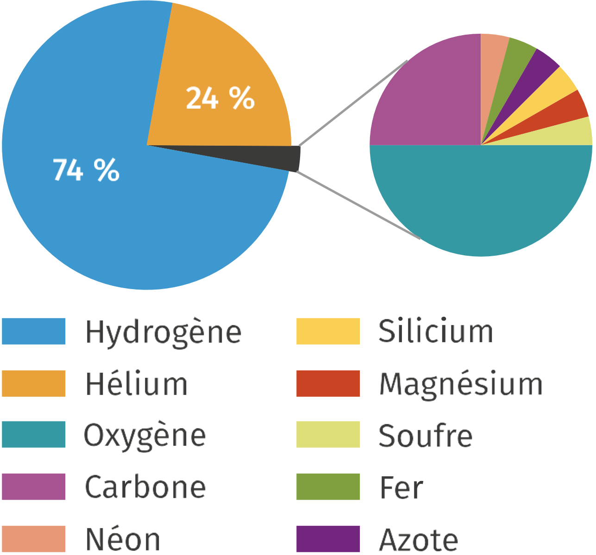
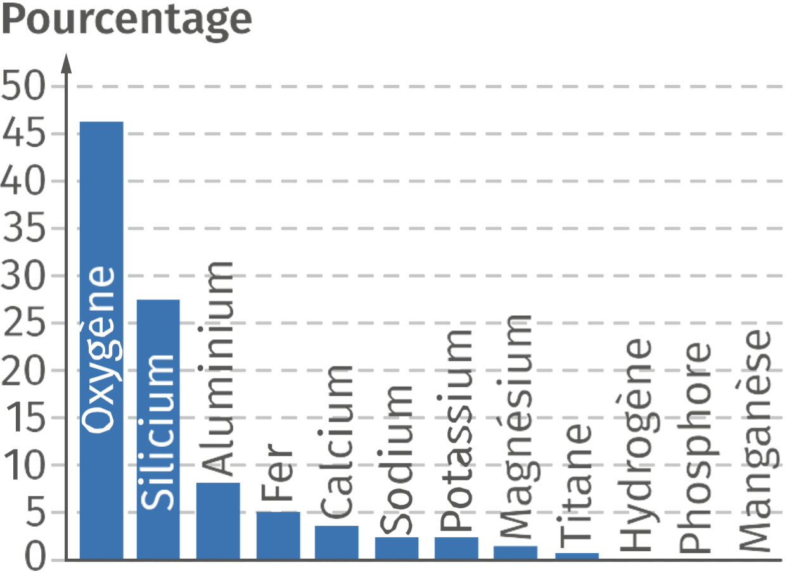
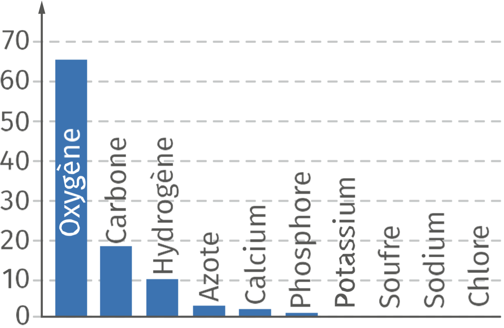

# Chapitre II : Les cristaux

{{ initexo(0) }}

   
Les cristaux, des édifices ordonnées

# 1. Les structures cristallines des solides

## A. Des solides cristallins ou amorphes
- On appelle solide tout système qui possède une forme propre.
- On distingue les solides cristallins constitués d'une répétition quasi parfaite d'arrangements d'entités chimiques (atomes, ions, molécules) dans les trois directions de l'espace et les solides amorphes correspondant à un état liquide figé et pour lesquels il n'y a pas d'ordre au-delà d'une échelle moléculaire.

## B. De la structure cristalline à la masse volumique
- On appelle **maille** l'unité de répétition d'un cristal par translation. En se répétant indéfiniment dans les trois dimensions de l'espace, elle définit le réseau cristallin. Sa forme la plus simple est celle d'un cube de côté a appelé paramètre de maille.
- Connaissant le nombre d'entités appartenant à la maille et leurs masses, il est possible de remonter
à des propriétés macroscopiques du solide cristallin comme sa	ρ :

ρ = mentitˊes
Vmaille
ρ : masse volumique (kg·m-3)
Vmaille : volume de la maille (m3)
mentitˊes : masse des entités constituant la maille (kg)

#2. Des roches aux êtres vivants: les cristaux sont partout!

- Caractérisés par une formule chimique, les minéraux s'organisent dans l'espace sous forme de cristaux. Ces cristaux sont la plus petite structure organisée qui compose généralement les roches.
- Dans de nombreux cas, les cristaux font également partie intégrante de la structure des êtres vivants (coquille, squelette, calcul rénal, émail des dents, etc.).
- La connaissance de la structure et du mode de formation des cristaux du vivant permet d'envisager des traitements médicaux.

# 3. Les conditions de formation des cristaux

- L'agencement des atomes qui forment les cristaux dépend des conditions de pression et de température. Un même composé de formule chimique unique pourra donc cristalliser dans différents systèmes cristallins.
 
- Dans le cas des roches formées par solidification d'un magma, la vitesse de refroidissement influence la formation des cristaux. Le refroidissement rapide d'un magma conduit à une cristallisation partielle. Il se forme alors des petits cristaux dispersés dans du verre, solide amorphe ne présentant pas d'organisation cristalline. En revanche, le refroidissement lent d'un magma permet la formation de gros cristaux jointifs.

## Pas de malentendu
On se limite ici à un cas idéal, c'est-à-dire aux solides cristallins dont l'organisation est supposée parfaitement régulière. Un cristal présente en réalité de nombreux défauts.

!!! note "Mots clés"

    : solide constitué d'entités chimiques arrangées de manière régulière.
    
    : roche entièrement ou partiellement fondue.

    : volume élémentaire qui se répète au sein d'un cristal. La structure de la maille impose les propriétés physicochimiques du cristal à l'échelle macroscopique.

    : rapport entre la masse et le volume d'un échantillon.

    : espèce chimique naturelle se présentant sous forme de solide à structure cristalline.

    : matériau composé d'un assemblage de minéraux, cristallins ou vitreux.

    : solide constitué d'entités chimiques dont l'arrangement est désordonné, contrairement au solide cristallin.

    : solide constitué d'une répétition quasi parfaite de l'arrangement des atomes dans les trois directions de l'espace, contrairement au solide amorphe.

    : solide amorphe formé par refroidissement très rapide d'un magma.

!!! info "Le saviez-vous ?"
    Certaines bactéries, dites magnétotactiques, forment des cristaux intracellulaires de magnétite (un oxyde de fer). Ceux-ci possèdent des propriétés magnétiques, permettant à ces bactéries de percevoir la direction du champ magnétique terrestre et de s'orienter par rapport à la direction de ce champ.
   
!!! info "Le saviez-vous ?"
    La chrysotile Mg3Si2O5(OH)4, bien plus connu sous le nom d'amiante, est un silicate de magnésium (ou éventuellement de calcium) qui cristallise en formant de fines fibres. Présentant des propriétés très
intéressantes, comme sa capacité à isoler thermiquement ou à protéger contre le feu, l'amiante a été massivement employée au cours du XXe siècle dans le secteur du bâtiment notamment. Néanmoins, ce
matériau est toxique et libère des fibres dans l'air provoquant l'apparition de divers cancers par inhalation. Il est interdit en France depuis 1997.

 

La maille du chlorure de sodium NaCl est schématisée ci-contre :
 	Elle nous permet d'extraire des données comme le nombre d'ions chlorure Cl−(c'est-à-dire 4) et d'ions sodium Na+(également 4) dans cette maille.
 	Ce nombre étant connu, avec les données de la masse des ions et du paramètre de la maille a, on peut calculer la masse volumique de l'espèce étudiée grâce à :
ρ = mentitˊes
Vmaille

 
 
 	L'essentiel du cours en vidéo
Visionnez une explication sur des édifices ordonnés : les cristaux
Lien vers vidéo : https://assets.lls.fr/pages/5737692/es-1re-chap-2-final.mp4

## 1. L'abondance des éléments chimiques

### A. La composition chimique de l'Univers

{: .center width="300"}

- L'hydrogène H est l'élément chimique le plus abondant : il représente à lui seul près de 75 % de la masse de matière dans l'Univers. L'hélium He est le deuxième élément le plus abondant dans l'Univers à près de 25 % en masse.

- Sur Terre, on a recensé 94 éléments chimiques différents présents dans la nature. 24 autres éléments ont été créés artificiellement en laboratoire.

### B. La composition de la Terre et des êtres vivants

Les éléments sont répartis de manière inégale dans l'Univers : 

- La Terre est formée principalement d'oxygène O, de silicium Si, d'aluminium Al et de fer Fe

<figure markdown="span">
{: .center width="300"}
    <figcaption>Abondance des éléments chimiques dans la croûte terrestre</figcaption>
</figure>

-  Les êtres vivants sont constitués de carbone C, d'oxygène O, d'hydrogène H et d'azote N.

<figure markdown="span">
{: .center width="300"}
    <figcaption>Abondance des éléments chimiques dans le corps humain</figcaption>
</figure>

## 2. La radioactivité et ses applications

### A. La découverte de la radioactivité

<iframe width="560" height="315" src="https://www.youtube.com/embed/clRcF7emyiM?si=NTfYTYel-44XwYKg" title="YouTube video player" frameborder="0"  referrerpolicy="strict-origin-when-cross-origin" allowfullscreen></iframe>

!!! example "{{ exercice() }} : Découverte de la radioactivité naturelle par Henri Becquerel" 
    Consultez les 3 premiers onglets ci-dessous et identifiez les observations qui ont permis à Henri Becquerel d'affirmer que la radioactivité est effectivement un phénomène naturel.
    === "Une hypothèse logique... mais fausse"
        - Pour bien comprendre la découverte de Becquerel, il faut saisir la différence fondamentale entre la FLUORESCENCE (ce qu'il croyait au départ) et la RADIOACTIVITÉ (ce qu'il a découvert).
        - Qu'est-ce que la FLUORESCENCE ?
            - C'est un phénomène physique par lequel un matériau absorbe de la lumière (ou un autre rayonnement) et la réémet presque immédiatement, sous une forme différente (souvent avec une longueur d'onde plus grande, comme de la lumière visible ou des rayons X).
            - Les caractéristiques essentielles de la fluorescence :
                - Elle a besoin d'une excitation extérieure (lumière du soleil, UV, etc.).
                - Elle est quasi-instantanée : l'émission cesse presque aussitôt que la source d'excitation est retirée (en moins d'un millionième de seconde).
                - C'est un phénomène superficiel et réversible.
            - Exemple courant : un vêtement blanc qui brille en bleu sous une lampe UV, mais qui redevient normal dès qu'on éteint la lampe.
        - En 1896, Henri Becquerel étudie les propriétés de fluorescence des sels d'uranium en les exposant aux rayons solaires, puis en les déposant sur une plaque photographique. Après quelques minutes, la plaque est impressionnée comme si elle avait été exposée à la lumière. Henri Becquerel suppose alors que l'uranium est fluorescent, c'est-à-dire capable d'absorber la lumière et de la réémettre sous forme de rayons X.
        - "Henri Becquerel suppose alors que l'uranium est fluorescent, c'est-à-dire capable d'absorber la lumière et de la réémettre sous forme de rayons X." Cette phrase résume parfaitement l'hypothèse de départ de Becquerel, mais elle contient une erreur scientifique par rapport à ce que l'on sait aujourd'hui.
        - Pour être tout à fait précis, voici pourquoi cette phrase est historiquement exacte (elle reflète ce que Becquerel pensait dans le contexte de 1896) mais physiquement fausse (la fluorescence de l'uranium ne produit PAS de rayons X) :
            - Les rayons X venaient d'être découverts par Röntgen en novembre 1895.
            - On savait que les rayons X traversaient la matière et impressionnaient les plaques photographiques.
            - Becquerel savait que les sels d'uranium devenaient fluorescents au soleil (ils brillaient d'une lumière jaune-verdâtre).
            - Il a fait le lien (erroné) : "Puisque l'uranium est fluorescent et puisque les plaques photographiques sont impressionnées par les rayons X, peut-être que l'uranium absorbe la lumière du soleil et la transforme en rayons X."
            - 👉 C'était une supposition logique pour l'époque, mais elle était fausse.
    === "Une découverte fortuite"
        - Comme les jours précédents, il s'était préparé pour réaliser son expérience classique : envelopper une plaque photographique dans du papier noir (pour qu'elle ne soit pas exposée à la lumière), déposer dessus des cristaux d'uranium, et les exposer au soleil pour activer leur fluorescence. Mais le ciel était couvert : À Paris, fin février 1896, le temps était nuageux. Becquerel ne pouvait pas faire l'expérience en plein soleil.
        - Il range donc le tout dans un tiroir : Plaque + cristaux d'uranium restent en contact, dans l'obscurité, en attendant une éclaircie. Plusieurs jours passent : Le soleil ne revient toujours pas. Becquerel, impatient, décide par acquis de conscience de développer la plaque, même sans exposition solaire.
        - Même s'il pensait que la fluorescence était nécessaire, Becquerel était un bon physicien. Il savait qu'une expérience négative (ne rien voir sur la plaque) est aussi une information précieuse :
            - Si la plaque était blanche → il aurait conclu : "Sans soleil, pas de fluorescence, donc pas de rayons X. Mon hypothèse est cohérente."
            - Si la plaque était noircie (ce qui arriva) → il a eu une surprise totale, une découverte accidentelle.
        - Becquerel n'avait aucune raison de s'attendre à une image. S'il avait été moins rigoureux ou moins curieux, il n'aurait pas développé la plaque, et la radioactivité aurait peut-être été découverte plus tard par quelqu'un d'autre. C'est son geste, en apparence inutile, qui a tout changé. 👏 C'est un magnifique exemple de la chance qui sourit aux esprits méthodiques ! 
    === "La radioactivié naturelle"
        - Becquerel découvre par hasard que si les sels d'uranium restent plusieurs jours dans un tiroir, une image apparaît tout de même sur une plaque photographique disposée à proximité ! Sa théorie sur la fluorescence des sels d'uranium est remise en cause et il en déduit que l'uranium émet des rayonnements de façon « naturelle ».
    === "Correction"        
        - Pour affirmer que la radioactivité est un phénomène naturel (et non un effet de la fluorescence lié à une exposition préalable au soleil), Henri Becquerel s'est appuyé sur plusieurs observations clés, issues de sa fameuse expérience "du tiroir" :
            1. L'absence totale de source d'énergie externe : Les sels d'uranium étaient restés plusieurs jours dans un tiroir fermé, à l'obscurité totale, sans aucun contact avec la lumière du soleil ou avec une quelconque autre source de rayonnement excitateur.
            2. La persistance de l'impression sur la plaque photographique : Malgré cette obscurité prolongée, la plaque photographique, placée à proximité des sels, s'est tout de même trouvée impressionnée (noircie) après le développement.
            3. Le contraste avec ses essais précédents : Les jours précédents, le ciel était nuageux. Becquerel avait justement reporté son expérience prévue (exposition au soleil) et rangé ses échantillons dans un tiroir. L'image obtenue était encore plus nette et intense que celle produite par les sels préalablement exposés à la lumière solaire.
            4. La continuité du phénomène dans le temps : L'impression sur la plaque ne se limitait pas à un bref instant après l'excitation solaire, mais s'était produite sur plusieurs jours, prouvant que l'émission de rayonnement était spontanée et continue, sans besoin d'être "rechargée" par la lumière.
        - Conclusion de Becquerel : Puisque l'émission de rayonnement se produisait sans apport préalable d'énergie lumineuse (contrairement à la fluorescence, qui nécessite une excitation et s'arrête presque aussitôt après), Becquerel en a déduit que ce rayonnement était émis de façon spontanée et intrinsèque par l'uranium lui-même, quel que soit son environnement. Il s'agissait donc bien d'une propriété naturelle de la matière, et non d'un phénomène optique dépendant des conditions extérieures.

    === "En résumé, le tableau comparatif"
        | Critère    | Fluorescence (hypothèse de départ)              | Radioactivité (découverte réelle)                       |
        |------------|-------------------------------------------------|---------------------------------------------------------|
        | Cause      | Besoin d'une excitation extérieure (soleil, UV) | Spontanée, sans aucune cause extérieure                 |
        | Durée      | Cesse immédiatement quand on coupe la source    | Continue, permanente (sur des jours, mois, années)      |
        | Origine    | Phénomène électronique de surface               | Phénomène nucléaire, venant du noyau de l'atome         |
        | Dépendance | Dépend des conditions extérieures               | Indépendante de la température, pression, lumière, etc. |

!!! example "{{ exercice() }} : La radioactivité naturelle"
    === "Énoncé"
    - Quelques années après les travaux de Henri Becquerel, Marie et Pierre Curie obtiennent le prix Nobel de physique en 1903 pour la découverte de la radioactivité naturelle.
    - Selon leurs travaux, certains noyaux atomiques sont instables et se désintègrent. Ce phénomène, appelé radioactivité, est un phénomène naturel qui se traduit par la transformation nucléaire d'un noyau instable en un autre. Le « noyau père » se transforme en un « noyau fils » de façon **inéluctable**, **aléatoire**, **spontanée** et **indépendante des conditions extérieures**. Les quatre adjectifs précédents ne sont pas redondants : ils décrivent quatre propriétés essentielles et complémentaires du phénomène nucléaire. Expliquez ce que chacun signifie précisément.
    
    ??? note "Correction"    
        | Adjectif     | Question à laquelle il répond                                | Exemple concret                               |
        |--------------|--------------------------------------------------------------|-----------------------------------------------|
        | Inéluctable  | Va-t-il finir par se désintégrer ?                           | Oui, c'est certain (un jour ou l'autre).      |
        | Aléatoire    | Quand exactement ?                                           | On ne peut pas le savoir pour un atome donné. |
        | Spontanée    | A-t-il besoin d'un déclencheur extérieur ?                   | Non, il le fait tout seul.                    |
        | Indépendante | L'environnement (chaleur, pression) change-t-il la vitesse ? | Non, la demi-vie est fixe et universelle.     |
    
        === "Inéluctable"
            - Sens : Un noyau instable finira par se désintégrer. Il n'y a pas d'échappatoire possible.
            - Explication : Si vous prenez un atome d'uranium-238, il a une probabilité donnée de se désintégrer. Mais surtout, il est certain qu'il finira par le faire... dans un temps caractéristique (sa demi-vie). On ne peut pas le "stabiliser" ou l'empêcher de se désintégrer. Ce n'est pas comme une réaction chimique qui peut être réversible ou empêchée par un catalyseur. Ici, c'est une fatalité nucléaire.
        === "Aléatoire"
            - Sens : On ne peut jamais prédire le moment exact où un noyau particulier va se désintégrer.
            - Explication : C'est une question de probabilité. Vous pouvez dire que sur 1 million de noyaux, la moitié se désintégrera en 4,5 milliards d'années (pour l'uranium-238), mais vous ne pouvez pas dire quel noyau précis se désintégrera à quel instant. C'est un jeu de hasard pur, régi par les lois de la mécanique quantique. Ce n'est pas déterministe (contrairement à une horloge ou à une réaction chimique classique où on peut prévoir précisément ce qui va se passer).
        === "Spontanée"
            - Sens : La désintégration se produit d'elle-même, sans aucune cause ou stimulus extérieur.
            - Explication : Le noyau n'a pas besoin d'être "activé" par un choc, un chauffage, une lumière, une pression, ou un champ magnétique. Le processus est interne au noyau. C'est exactement ce qui oppose la radioactivité à la fluorescence (que Becquerel imaginait au départ). La fluorescence a besoin d'une excitation extérieure (la lumière du soleil) ; la radioactivité, non.
        === "Indépendante des conditions extérieures"
            - Sens : La vitesse de désintégration (la demi-vie) ne change pas, que l'atome soit gelé à -270°C, porté à 1000°C, comprimé sous des pressions énormes, ou plongé dans un acide.
            - Explication : La radioactivité vient du noyau atomique, qui est protégé par le nuage électronique. Les conditions extérieures (température, pression, champs électriques) n'affectent que les électrons périphériques, pas les forces nucléaires fortes qui lient les protons et neutrons à l'intérieur du noyau. Une réaction chimique (comme la combustion du papier) est très sensible à la température ; pas la radioactivité. C'est pour cela qu'on peut dater des roches ou des fossiles vieux de millions d'années sans se soucier des changements climatiques qu'ils ont subis.

Certains noyaux sont instables et se désintègrent pour former d'autres noyaux: on dit qu'ils sont radioactifs. La radioactivité est un phénomène aléatoire, inéluctable, spontané et qui ne dépend que du type de noyau radioactif et sa demi-vie. Elle a été découverte par Henri Becquerel et étudiée par Marie Curie au début du XXe siècle.

### B. Les applications actuelles
Plusieurs techniques médicales reposent sur la radioactivité : l'imagerie pour réaliser des examens exploratoires ou établir des diagnostics (radiographie, scintigraphie, TEP), la radiothérapie ou la curiethérapie consistant à irradier une tumeur. La radioactivité est également utilisée dans d'autres domaines comme l'archéologie ou la géologie pour dater des artefacts ou des roches.

### C. Les précautions à prendre
Les rayonnements émis par les noyaux radioactifs peuvent pénétrer les tissus vivants et altérer le fonctionnement des cellules. Il est donc nécessaire de prendre des précautions (port de protections, durée d'exposition limitée).

## 3. Les réactions de fission et de fusion

### A. La fusion nucléaire au cœur des étoiles
La fusion est la réaction entre deux noyaux légers pour former un noyau plus lourd. Au cœur des étoiles, les noyaux d'hydrogène \(\isotope{1}{1}{H}\) fusionnent pour former de l'hélium \(\isotope{4}{2}{He}\). 

Cette réaction nucléaire libère une très grande quantité d'énergie.

!!! info "Le noyau le plus stable est le fer (Z = 26)"
    Toutes les fusions nucléaires jusqu'au fer libèrent de l'énergie tandis que celles formant des noyaux plus lourds nécessitent de l'énergie. Pour cette raison, le fer est le dernier élément créé par le processus de fusion « classique ». Tous les autres éléments sont créés lors de l'explosion des étoiles à leur fin de vie ou dans des laboratoires de physique nucléaire.

### B. Les réactions de fission provoquées
Certains noyaux lourds se cassent en deux noyaux plus légers sous l'impact de neutrons : ce processus est appelé fission nucléaire. Cette réaction est mise à profit dans les centrales nucléaires pour produire de l'électricité à partir de l'énergie thermique libérée au cours de la réaction.

