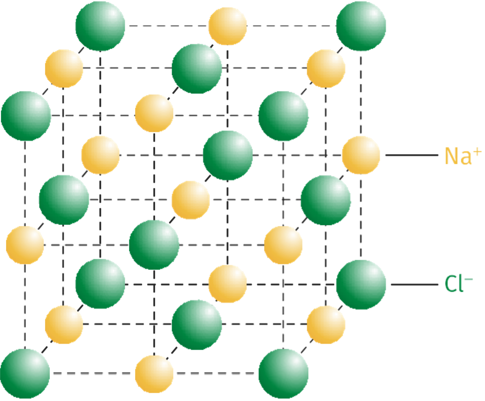

# Chapitre 4 : Les cristaux (page en travaux)

{{ initexo(0) }}

   
Les cristaux, des édifices ordonnées

## 1. Les structures cristallines des solides ##

### A. Des solides cristallins ou amorphes ###

- On appelle solide tout système qui possède une forme propre.
- On distingue les solides cristallins constitués d'une répétition quasi parfaite d'arrangements d'entités chimiques (atomes, ions, molécules) dans les trois directions de l'espace et les solides amorphes correspondant à un état liquide figé et pour lesquels il n'y a pas d'ordre au-delà d'une échelle moléculaire.

### B. De la structure cristalline à la masse volumique ###

- On appelle **maille** l'unité de répétition d'un cristal par translation. En se répétant indéfiniment dans les trois dimensions de l'espace, elle définit le réseau cristallin. Sa forme la plus simple est celle d'un cube de côté a appelé paramètre de maille.
- Connaissant le nombre d'entités appartenant à la maille et leurs masses, il est possible de remonter
à des propriétés macroscopiques du solide cristallin comme sa	ρ :

ρ = mentitˊes
Vmaille
ρ : masse volumique (kg·m-3)
Vmaille : volume de la maille (m3)
mentitˊes : masse des entités constituant la maille (kg)

## 2. Des roches aux êtres vivants: les cristaux sont partout!

- Caractérisés par une formule chimique, les minéraux s'organisent dans l'espace sous forme de cristaux. Ces cristaux sont la plus petite structure organisée qui compose généralement les roches.
- Dans de nombreux cas, les cristaux font également partie intégrante de la structure des êtres vivants (coquille, squelette, calcul rénal, émail des dents, etc.).
- La connaissance de la structure et du mode de formation des cristaux du vivant permet d'envisager des traitements médicaux.

## 3. Les conditions de formation des cristaux ##

- L'agencement des atomes qui forment les cristaux dépend des conditions de pression et de température. Un même composé de formule chimique unique pourra donc cristalliser dans différents systèmes cristallins.
 
- Dans le cas des roches formées par solidification d'un magma, la vitesse de refroidissement influence la formation des cristaux. Le refroidissement rapide d'un magma conduit à une cristallisation partielle. Il se forme alors des petits cristaux dispersés dans du verre, solide amorphe ne présentant pas d'organisation cristalline. En revanche, le refroidissement lent d'un magma permet la formation de gros cristaux jointifs.

### Pas de malentendu ###

On se limite ici à un cas idéal, c'est-à-dire aux solides cristallins dont l'organisation est supposée parfaitement régulière. Un cristal présente en réalité de nombreux défauts.

!!! note "Mots clés"

    : solide constitué d'entités chimiques arrangées de manière régulière.
    
    : roche entièrement ou partiellement fondue.

    : volume élémentaire qui se répète au sein d'un cristal. La structure de la maille impose les propriétés physicochimiques du cristal à l'échelle macroscopique.

    : rapport entre la masse et le volume d'un échantillon.

    : espèce chimique naturelle se présentant sous forme de solide à structure cristalline.

    : matériau composé d'un assemblage de minéraux, cristallins ou vitreux.

    : solide constitué d'entités chimiques dont l'arrangement est désordonné, contrairement au solide cristallin.

    : solide constitué d'une répétition quasi parfaite de l'arrangement des atomes dans les trois directions de l'espace, contrairement au solide amorphe.

    : solide amorphe formé par refroidissement très rapide d'un magma.

!!! info "Le saviez-vous ?"
    Certaines bactéries, dites magnétotactiques, forment des cristaux intracellulaires de magnétite (un oxyde de fer). Ceux-ci possèdent des propriétés magnétiques, permettant à ces bactéries de percevoir la direction du champ magnétique terrestre et de s'orienter par rapport à la direction de ce champ.
   
!!! info "Le saviez-vous ?"
    La chrysotile Mg3Si2O5(OH)4, bien plus connu sous le nom d'amiante, est un silicate de magnésium (ou éventuellement de calcium) qui cristallise en formant de fines fibres. Présentant des propriétés très
intéressantes, comme sa capacité à isoler thermiquement ou à protéger contre le feu, l'amiante a été massivement employée au cours du XXe siècle dans le secteur du bâtiment notamment. Néanmoins, ce
matériau est toxique et libère des fibres dans l'air provoquant l'apparition de divers cancers par inhalation. Il est interdit en France depuis 1997.

 

La maille du chlorure de sodium NaCl est schématisée ci-contre :
 	Elle nous permet d'extraire des données comme le nombre d'ions chlorure Cl−(c'est-à-dire 4) et d'ions sodium Na+(également 4) dans cette maille.
 	Ce nombre étant connu, avec les données de la masse des ions et du paramètre de la maille a, on peut calculer la masse volumique de l'espèce étudiée grâce à :
ρ = mentitˊes
Vmaille

{: .center width="300"}

 
 
 	L'essentiel du cours en vidéo
Visionnez une explication sur des édifices ordonnés : les cristaux
Lien vers vidéo : https://assets.lls.fr/pages/5737692/es-1re-chap-2-final.mp4

